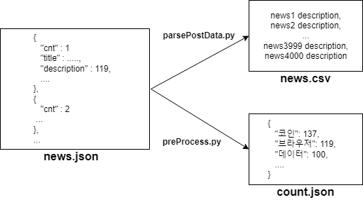

# News-keyword-analysis

- Get news title & description and analyze based-on keyword.

# How To

1. Make **Naver API search client account".
Check this [LINK](https://developers.naver.com/docs/search/blog/).

2. Config setting.
- client_id : your naver search API application Client ID<sup>[tip1](#config_tip1)</sup>.
- client_secret : your naver search API application Client Secret.
- node : project data is organized with naver news. you can organize data with another node. check [tip2](#config_tip2). after you change node, you must edit method getNaverSearch function in **parsePostData.py**.
- search_texts : set this with keyword what you want to analyze.

3. In root directory run below command.

```
python main.py
```

### tip

<a name="config_tip1">1</a> Click Client ID in https://developers.naver.com/apps/

<a name="config_tip2">2</a> https://developers.naver.com/docs/serviceapi/search/blog/blog.md

## EXCEPTIONS
### 1.
```
File "D:\Anaconda3\lib\site-packages\joblib\externals\loky\backend\resource_tracker.py", line 204, in _send
    msg = '{0}:{1}:{2}\n'.format(cmd, name, rtype).encode('ascii')
UnicodeEncodeError: 'ascii' codec can't encode characters in position 18-20: ordinal not in range(128)
```
when you have problem in running **createLDA** method, change encoding way at code of warning path.
```
... .encode('ascii') => ... .encode('utf-8')
```
### 2.
```
The _imagingft C module is not installed
```
Solve is here link. https://stackoverflow.com/questions/4011705/python-the-imagingft-c-module-is-not-installed

# Framework
## Generate Data
